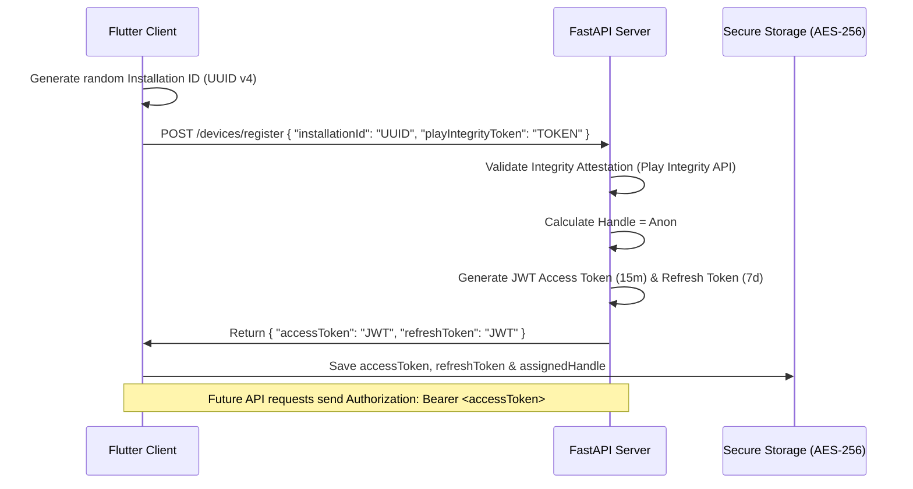

# Vadodara Local — Complete System Architecture & Security Blueprint (v5)
### Consolidated Specification of Product Flows, Databases, Cryptographic Session Auth, Media Proxy CDN, and Security Hardening

---

## 1. System Overview & The "Zero-Trust Client" Architecture

Vadodara Local is a privacy-first, hyper-local community platform. The foundational security rule of this architecture is: **The Flutter App is inherently Untrusted**. Attackers can decompile, modify, repack, or instrument the APK. Therefore, no critical security decisions are made on the client.

### Final Recommended Architecture

```text
                  LOCALV1 FLUTTER
                         │
        ┌────────────────┼─────────────────┐
        │                │                 │
       UI          Secure Storage       Local Cache
        │                │                 │
        └────────────────┼─────────────────┘
                         │
                    ApiClient
                         │
                    HTTPS only
                         │
                         ▼
                 ┌───────────────┐
                 │    FastAPI    │
                 └───────┬───────┘
                         │
             ┌───────────┼───────────┐
             │           │           │
          Auth       Abuse/Risk   GeoIP
             │           │           │
             └───────────┼───────────┘
                         │
                     Firestore
```

### Delegation of Responsibilities

**✅ What belongs in Flutter (UX & Orchestration):**
* UI rendering & interactive elements (e.g., Optimistic voting).
* Provider/Repository integrations.
* Secure token storage & Caching (Treating local cache as UI state, not truth).
* Installation ID generation.
* Requesting Play Integrity tokens.
* Image/Video compression and pre-upload validation.
* Centralized API error handling & Pagination logic.

**❌ What NEVER belongs in Flutter (Security Authority):**
* "User is in Vadodara" decision (Resolved via backend GeoIP).
* "User is not using a VPN" final decision (Backend verifies headers + ASN).
* Post owner authorization (Backend validates JWT against authorHandle).
* Final Vote count truth (Backend enforces constraints and idempotency).
* Authentication validity checks.
* Admin/moderation authority controls.
* Raw API secrets or Firebase service-account keys.

---

## 2. Onboarding & JWT Authentication Redesign (§8.2)

To securely manage client sessions and rotate keys, the system relies on a standard OAuth2-like **Access + Refresh Token** architecture. The `installationId` is strictly a telemetry/hardware signal, NOT the session token itself.



### Verification Protocol (Server-Side):
*   **Play Integrity Token:** The Flutter app generates/requests the token via Play Integrity API (it does not declare itself trustworthy). The backend verifies this token with Google servers.
*   On every authenticated request, the backend validates the Bearer JWT signature. If expired, the client automatically requests a new access token using the Refresh Token.

---

## 3. Real-Time Cloud Database Topology (Firestore Schema)

Firestore rules block all client-side writes, ensuring that data can only be written by the secure Backend SDK.

### A. Firestore Collections & Documents Schema

#### 1. `/posts` Collection (Flat Feed Structure)
*   **Fields:**
    *   `authorHandle` (String): e.g. `Anon#9A8F3D`
    *   `content` (String): Normalized and validated body.
    *   `imageUrl` (String?): Decoupled Media Proxy URL, e.g. `http://backend/api/v1/media/{mediaId}`, or `null`.
    *   `area` (String): Neighborhood name corresponding to `VadodaraArea` enum.
    *   `category` (String): Topic label corresponding to `PostCategory` enum.
    *   `createdAt` (FieldValue.serverTimestamp): Creation timestamp.
    *   `upvotes` (Number), `downvotes` (Number), `commentCount` (Number).
    *   `isEmergency` (Boolean): True if category is emergency.
    *   `hiddenByMod` (Boolean): True if soft-hidden.
    *   `reportCount` (Number): Dynamic counter.

#### 2. `/posts/{postId}/comments` Subcollection (Thread Level)
*   **Fields:** `authorHandle` (String), `content` (String), `createdAt` (timestamp).

#### 3. `/posts/{postId}/votes/{user_handle}` Subcollection (Scale-safe Votes)
*   **Fields:** `direction` (Number: 1 or -1).

#### 4. `/posts/{postId}/reports/{reporter_handle}` Subcollection (Spam-safe Reports)
*   **Fields:** `reporterHandle` (String), `reason` (String), `status` (String: "pending" | "reviewed"), `createdAt` (timestamp).

#### 5. `/media` Collection (Decoupled Media Registry)
*   **Fields:** `mediaId` (String), `telegramFileId` (String), `telegramMessageId` (String?), `storageProvider` (String), `backupObjectKey` (String?), `contentHash` (String), `size` (Number), `mimeType` (String), `createdAt` (timestamp), `deletedAt` (timestamp?).

#### 6. `/moderators` Collection (Administrative Auth Credentials)
*   **Fields:** `modId` (String: email), `email` (String), `hashedPassword` (String - SHA-256), `role` (String: "moderator" | "admin" | "superadmin"), `mfaSecret` (String), `status` (String: "active" | "suspended"), `createdAt` (timestamp).

#### 7. `/banned_users` Collection (Blacklist)
*   **Fields:** `handle` (String - anonymous user handle), `bannedBy` (String), `reason` (String), `createdAt` (timestamp).

---

## 4. Media Proxy Serving Protocol (§8.4)

Raw Telegram URLs are permanent and public. To close this leakage vector, all image retrieval requests are proxied:

1.  **Storage:** Instead of storing raw Telegram links in the database, the server stores the `file_id` inside a proxy serving URL:
    `http://127.0.0.1:8000/api/v1/media/{file_id}`
2.  **Streaming:** When the client requests the image, the backend uses its server-side token to query Telegram `getFile`, downloads the binary payload on the fly, and streams the bytes to the mobile client.
3.  **Access Control:** This enables the server to verify if a post is deleted or if a user is blocked before streaming the image bytes.

---

## 5. Security & Input Hardening

### A. Multi-Stage Unicode Hardening Pipeline (§20)
To prevent content filter bypasses (spacing tricks, homoglyphs, zero-width characters, mixed-script confusables), all text inputs undergo a multi-stage validation pipeline on the backend prior to validation scans:
1. **Unicode NFKC Normalization:** Decomposes and recomposes compatibility characters using `unicodedata.normalize("NFKC", raw_text)`.
2. **Zero-Width Character Stripping:** Removes non-printing zero-width joiners/spaces (`\u200b`, `\u200c`, `\u200d`, `\ufeff`) and control characters which are commonly inserted to bypass substring checking.
3. **Homoglyph Translation:** Maps lookalike Unicode letters from different scripts (Greek, Cyrillic, Fullwidth Latin) to their Latin/ASCII representations using a translation lookup table (e.g. Cyrillic `а` to Latin `a`, Greek `ε` to Latin `e`). This addresses the limitations of standard NFKC homoglyph mapping.
4. **Spacing Collapse:** Collapses whitespaces, tabs, hyphens, periods, and underscores to catch spaced profanities.
5. **Casefolding:** Applies `text.casefold()` for unicode case-insensitive matching.
6. **Non-Destructive Storage:** To avoid false-positives and preserve formatting (such as legitimate emoji or spacing layouts), **only the raw original text is written to Firestore**. The normalized string is used strictly for safety scans, slur checks, and doxxing filters.

### B. Client-Side XSS Protection & Output Safety (§21, §22)
To protect clients from script injection, cross-site scripting (XSS), phishing, and redirection scams, output safety is strictly enforced across the application lifecycle:
1. **Plain Text Enforcement:** The Flutter application renders all posts and comments strictly as plain text using standard `Text` widgets. The application does not include rich HTML parse engines, custom webviews, or markdown widgets that interpret styling tags or run embedded scripts.
2. **Multi-Stage Phishing Analysis Pipeline:** All extracted URLs are validated on the backend prior to storage:
   * **URL Parser Validation:** All URLs are parsed using strict URI libraries (`urllib.parse` / `Uri.parse`) to extract host components.
   * **Allowed Schemes:** The URI scheme must strictly match `"https"`. Blacklisted schemes (`javascript:`, `data:`, `file:`) are blocked.
   * **Punycode / IDN Homoglyph Check:** Hostnames starting with `xn--` or containing non-ASCII characters are instantly rejected to prevent visual domain spoofing.
   * **Redirect Chain Resolution:** Standard link shorteners (`bit.ly`, `tinyurl.com`, etc.) are resolved by querying headers (`requests.head`). The server follows the redirect location header recursively up to **5 hops** to inspect the final target domain.
   * **Domain Reputation Check:** The final target domain must be verified against an allowlist of safe services (`SAFE_DOMAINS`). Unrecognized or risky domains are rejected with `400 Bad Request`.
3. **Leaving App Warning (Client Dialog):** If hyperlinking is enabled in the client feed UI, clicking any link must trigger a modal warning:
   * **Warning Text:** `"You're leaving Vadodara Local. We cannot guarantee the safety of this external link."`
   * The user must explicitly confirm before the OS launches the URL in an external web browser.

### C. Strict API Validations & Untrusted Client States (§23)
The backend gateway rejects any payloads that do not strictly comply with structural validation limits. Furthermore, the backend NEVER trusts the client's local state or optimistic UI data.
*   **Enforced String Constraints:**
    *   **Post Content:** Minimum 1 character, maximum **5,000 characters**.
    *   **Comment Content:** Minimum 1 character, maximum **1,000 characters**.
    *   **Image URL:** Optional, maximum **500 characters**.
    *   **Email Format:** Scanned via regex `^[^@]+@[^@]+\.[^@]+$` (minimum length 5, maximum 100).
    *   **MFA Code:** Numeric code strictly 6 characters (`^\d{6}$`).
*   **Allowed Domain Enums (Literals):**
    *   **VadodaraArea:** Strictly validated against allowed neighborhood keys.
    *   **PostCategory:** Strictly validated against category tags.
*   **Vote Direction & Optimistic UI Defense:** The Flutter client uses optimistic UI (showing +1 immediately) and stores vote states in local `SharedPreferences` to improve UX. However, **SharedPreferences is strictly a UI cache, not the source of truth**, as compromised devices can tamper with it. The backend ignores client-side vote counts and strictly enforces the JSON payload `direction ∈ {-1, 0, 1}`. If an attacker sends `{"direction": 999}` or `{"direction": "hack"}`, the request is immediately rejected.
*   **Device Attestation ID:** Installation ID validated to match UUIDv4 string pattern (`^[0-9a-fA-F-]{36}$`).

### D. HTTP Request Replay & Idempotency Protection (§29)
To block packet replay attacks, duplicate posts, double-voting, and duplicate comment submissions during network retries, all state-changing API endpoints support and enforce idempotency controls:
1. **Idempotency-Key Header:** State-changing routes (`/posts/create`, `/comment`, `/vote`, `/report`, `/delete`, `/storage/upload`, `/devices/register`, administrative actions) accept a client-generated `Idempotency-Key` (typically a unique UUIDv4 string).
2. **Server-Side Cache Verification:** Before processing the action, the backend searches an in-memory cache (`IDEMPOTENCY_CACHE`) for the provided key. If the key exists, the backend bypasses database execution and immediately returns the cached response, preventing duplicate side-effects.
3. **Cache Expiry (Memory Leak Protection):** Idempotency records are held in memory for a sliding window of **10 minutes** (600 seconds), after which they are automatically purged.

### E. Exception Masking (Verbose Stack Trace Defense)
A global FastAPI exception handler intercepts all unhandled errors, logs detailed stack traces on the server console, and returns a generic, sanitized response to the client.

### E. Dual-Key Multi-Route Rate Limiting (§9)
The backend enforces distinct rate limit thresholds based on request types and keys to isolate and block attacks:
*   **IP-Based Limit:** `/devices/register` is limited to **5 registrations per minute per IP** to block account-generation script loops.
*   **Session-Based Route Limits:**
    - `/posts/create` -> **5 posts per minute** per installation ID.
    - `/comment` -> **20 comments per minute** per installation ID.
    - `/vote` -> **60 votes per minute** per installation ID.
    - `/report` -> **10 reports per minute** per installation ID.
    - `/storage/upload` -> **5 uploads per minute** per installation ID.
*   **Production Migration Path:** For horizontal scaling and container restarts, these in-memory sliding dictionaries can be mapped directly to a Redis key-value cache using `slowapi` or custom middleware.

### D. Media Proxy Hardening (§10)
To prevent proxy endpoint abuse of `/api/v1/media/{file_id}`, the following controls are enforced:
1. **DB Verification Check:** Before proxying any download request from Telegram, the backend searches Firestore for active posts containing that specific media proxy URL. If no matching post exists, or if the linked post is hidden (`hiddenByMod == true`) or heavily reported (`reportCount >= 3`), the download request is rejected with `403 Access Denied`. This prevents attackers from using our proxy bot token to download arbitrary files hosted on Telegram.
2. **In-Memory Cache (Bandwidth DoS Mitigation):** A sliding cache stores the downloaded image bytes and headers. Repeat requests for the same image are served directly from RAM cache, saving external CDN/Telegram network costs and preventing server overload.

### E. Mass Scraping Control & Pagination Architecture (§24)
To prevent crawler engines, modded client applications, and bots from bulk harvesting public posts or causing Firestore direct-read billing spikes, the following data limits are enforced:
1. **Cursor-Based Pagination:** The database uses cursor-based pagination via document snapshots (`startAfterDocument`) instead of offset-based queries. Offset queries scan all prior elements in order (increasing cost and scraping speed). Cursors allow loading exactly 20 posts per page.
2. **Page Size Limit:** Pages are strictly capped at **20 posts per query**. Real-time streams are restricted to the initial 20 posts of the feed page. Subsequent historical scrolling uses one-time `get()` query chunks.
3. **Aggressive Depth Capping:** The client post repository enforces a maximum depth limit of **200 posts** in local memory. Scrolling past 200 posts is blocked, preventing scrapers from writing scripts to traverse the entire community database while preserving an excellent feed reading experience for normal users.
4. **Feed Rate Limiting:** Global rate limit filters monitor feed fetches on the client/proxy layers to block automated request loops.

### F. Media (Image & Video) Upload Hardening (§11)
To protect platform resources and user privacy, uploads enforce a dual-validation pipeline (Frontend + Backend):
1. **Frontend Optimistic Checks & UX:** Before uploading, the Flutter client must locally verify file size (Max **5MB** for Images, Max **500MB** for Videos), check MIME type, decode image/video metadata to verify dimensions, and compress the media. To preserve UX during large video uploads, the client displays a real-time progress bar and upload notification.
2. **Backend Strict Validation:** The backend completely ignores the client-provided `filename` (preventing payload masking). It independently enforces strict size constraints.
3. **MIME/Extension Verification:** Magic byte headers are scanned by the backend to guarantee the file is not a disguised executable (allowing only `.jpg`, `.jpeg`, `.png`, `.webp`, `.mp4`).
4. **Decompressed DoS Limit:** Rejects images exceeding **4096 x 4096** dimensions (protecting server RAM from decompression bomb payloads).
5. **EXIF/GPS Metadata Stripping:** Image pixels are read, decoded, and re-encoded. This drops all location data, device details, and custom app tags automatically before forwarding it to the CDN proxy.

### F. Decoupled Media Registry & Outage Resilience (§12)
To prevent Telegram from being a Single Point of Failure (SPOF) for image hosting, we decouple client-side media requests from specific Telegram File IDs:
1. **Database Schema (/media/{mediaId}):**
   ```json
   {
     "mediaId": "UUID-String",
     "telegramFileId": "telegram-file-id-string",
     "telegramMessageId": null,
     "storageProvider": "telegram",
     "backupObjectKey": "optional-s3-or-gcs-path",
     "contentHash": "sha256-string",
     "size": 1048576,
     "mimeType": "image/jpeg",
     "createdAt": "serverTimestamp",
     "deletedAt": null
   }
   ```
2. **Duplicate Content Deduplication:** Upload requests calculate the SHA-256 hash of the sanitized image binary. If the hash matches an existing media document, the write and upload steps are bypassed entirely and the existing `mediaId` proxy URL is returned (saving database writes and bandwidth).
3. **Resilience Fallback:** The `/media/{media_id}` serve endpoint dynamically loads the storage provider. If the Telegram Bot CDN goes offline or files are deleted, the server handles backup recovery by falling back to serving files from GCS/R2 buckets.

### G. BOLA-Protected Deletion Pipeline (§13)
To ensure complete and secure data removal, deletion requests execute a multi-step pipeline rather than just deleting the primary Firestore document. While the Flutter UI hides the delete button for non-authors, this is merely a UX feature.
1. **BOLA Ownership Check (Strict Server-Side):** An attacker can bypass the UI and directly call `DELETE /posts/{postId}`. Therefore, the backend extracts the user's handle from the validated JWT and strictly verifies it matches the post's `authorHandle` before allowing any deletion.
2. **Post Soft-Delete:** Sets `deletedAt = serverTimestamp` and `hiddenByMod = true` on the Firestore post document. The `hiddenByMod` flag instantly excludes the post from all client feed queries.
3. **Media Soft-Delete:** Locates the associated `/media/{mediaId}` document and sets `deletedAt = serverTimestamp`.
4. **RAM Cache Eviction:** Evicts the `mediaId` immediately from the backend's in-memory proxy caches (`MEDIA_CACHE` and `MEDIA_TYPE_CACHE`) so the image is instantly unreachable even if requested.
5. **CDN & Backup Deletion:** Triggers background calls to Telegram Bot API (`deleteMessage` if within Telegram's deletion window) and deletes backup files from Cloudflare R2 / GCS storage using the `backupObjectKey`.
6. **30-Day Purge Cron:** Soft-deleted posts and media documents are permanently removed from Firestore after a 30-day retention window to comply with local storage standards.

### H. Network Anti-Spoofing & UI Distinctions (§30)
To prevent network-level spoofing and distinguish between UX conveniences and true security boundaries, the following rules apply:
1. **IP Resolution (No External APIs):** The Flutter client MUST NOT call external IP services (like `api.ipify.org`). This introduces unnecessary network requests, privacy risks, and spoofable dependencies. Instead, the backend natively resolves the true client IP using the HTTP `X-Forwarded-For` header or direct socket connection via a trusted reverse proxy.
2. **Untrusted VPN Signals:** If the client sends an `x-vpn-detected` header, the backend treats this strictly as a non-binding signal. Attackers can trivially modify the app to send `x-vpn-detected: false`. Security decisions regarding VPNs must combine the IP against backend datasets (IP reputation, ASN databases, proxy lists) and Play Integrity attestation.
3. **UI Debounce vs. Backend Security:** The Flutter client implements a **300ms debounce** on interactions like voting to provide a smooth UX and prevent accidental double-taps. However, this is NOT a security feature. Attackers can bypass the UI to flood the backend with `POST /vote` requests. Therefore, the backend relies strictly on its own Rate Limiting, Idempotency Keys, and Server-Side Validation to secure these endpoints.
### I. Client Network Architecture & Resilience (§31)
To ensure robustness in production and prevent scattered HTTP logic, the Flutter application delegates all API communication to a centralized **ApiClient** wrapper rather than making raw HTTP calls in every repository:
1. **Centralized Retries & Timeouts:** The ApiClient sets a strict **10-second timeout** for general requests and implements exponential backoff retries for transient failures (e.g. 502 Bad Gateway), avoiding scattered 5-second hardcoded timeouts in individual methods like voting or feed fetching.
2. **Auth Header & Token Rotation:** The ApiClient automatically injects the `Authorization: Bearer <token>` header into every request. If a `401 Unauthorized` is returned, it pauses the queue, uses the Refresh Token to securely obtain a new Access Token, and retries the original request seamlessly.
3. **Traceability (Request ID):** Generates and attaches a unique `x-request-id` header to every outbound call for end-to-end debugging in backend logs.
4. **Production-Safe Error Handling:** Raw exceptions and stack traces are suppressed. Instead of `debugPrint` or raw exceptions leaking internal server structures, the UI maps HTTP errors to meaningful user-facing messages (e.g., "Network unavailable", "Session expired", "Verification required", "Post no longer exists", or "Server unavailable").
---

## 6. Firestore Security Rules
```javascript
rules_version = '2';
service cloud.firestore {
  match /databases/{database}/documents {
    // Posts can only be read if not flagged/hidden
    match /posts/{postId} {
      allow read: if resource.data.get('hiddenByMod', false) == false
                   && resource.data.get('reportCount', 0) < 3;
      allow write: if false; // Block client direct writes
    }
    match /posts/{postId}/comments/{commentId} {
      allow read: if true;
      allow write: if false;
    }
    // Admin logs are admin-only, completely blocked for clients
    match /moderators/{modId} {
      allow read, write: if false;
    }
  }
}
```

> **🛡️ Cost & Scraping Protection Protocols:**
> 1. **Merged Document Schema:** Flag tracking (`reporters`, `reportCount`) is stored directly on the `/posts` document. This saves database read costs by 50% since the client doesn't run a second query loop.
> 2. **Strict Query Limits:** Client-side real-time streams are locked to a maximum of 50 documents (`.limit(50)`), preventing automated scripts from bulk-downloading the entire Firestore collection.
> 3. **Firebase App Check:** Blocks non-app requests from calling Firestore reads, verifying device signatures prior to allowing socket connections.

---

## 7. Legal Compliance & Privacy Disclosures (India, IT Rules 2021)

### A. The "Anonymous ≠ Untraceable" Privacy Boundary
To protect user privacy while preventing systemic abuse, the system strictly partitions data visibility:
*   **Public Anonymity:** Public users see only the pseudonym handle (e.g. `Anon#9A8F3D`) generated via:
    $$\text{Handle} = \text{"Anon\#"} + \text{First6Chars}\Big(\text{SHA-256}\big(\text{InstallationID} + \text{":"} + \text{SERVER\_SALT}\big)\Big)$$
    No public profile, geolocation tracker, or hardware parameters are ever exposed.
*   **Private Backend Traceability:** The backend associates the cryptographically signed session token (Access/Refresh keys) with server-side security rate limiters and moderation flags. This correlation is kept strictly private, inaccessible to client devices, and used only to block bot attacks, enforce bans, and satisfy intermediary legal warrants.

### B. Privacy Policy Specifications
The platform maintains compliance under the **IT Rules 2021** (Intermediary Guidelines) and **DPDP Act 2023**:
1.  **No PII Collection:** The platform collects zero names, emails, phone numbers, contacts, or real-time GPS locations.
2.  **App Installation ID:** A random UUID is generated on device install. The raw UUID is never saved directly in the database. Instead, its one-way cryptographic signature (`SHA-256`) is stored.
3.  **Third-Party Media CDN:** Uploaded images are proxied through the backend server and hosted on a private Telegram channel CDN. Raw Telegram bot URLs are strictly hidden from users and served exclusively via the server's Media Proxy.
4.  **Grievance Officer:** A designated Grievance Officer email is listed in the application. Grievances are acknowledged within 24 hours and addressed within 15 days.

---

## 8. Data Retention Policy

| Data Category | Storage Location | Retention Duration | Disposal Mechanism |
| :--- | :--- | :--- | :--- |
| **Active Posts / Comments** | Cloud Firestore (`/posts`) | Indefinite while active | Direct document purge |
| **Deleted Posts** | Cloud Firestore | 30 days (soft-delete recovery window) | Automated Firestore TTL purge |
| **Moderation Logs / Audits** | Cloud Firestore (`/moderationLog`) | 1 year (legal requirement) | Scripted batch deletion |
| **Banned Installation IDs** | Cloud Firestore (`/bannedDevices`) | Indefinite | Retained for abuse prevention |
| **Telegram Hosted Images** | Telegram CDN | Synced with post deletion | Triggered deletion via `deleteMessage` API |
| **Security Cache / Rate Limiter** | Server memory (in-memory dict) | 60 seconds sliding window | Automatic garbage collection |

---

## 9. Backup & Disaster Recovery

*   **Firestore Exports:** Scheduled exports configured daily to a Cloud Storage bucket: `gcloud firestore export gs://your-backup-bucket`.
*   **Backups:** Retain last 30 daily backups.
*   **Media Mirroring:** Mirror uploads to a secondary secure cloud bucket (Cloudflare R2 or S3) to guarantee availability if a Telegram channel is banned.

---

## 10. Verification & Test Suite

### A. Backend Testing (`pytest`)
*   Tests `moderation.py` Unicode validators and regex normalization scripts.
*   Tests session token signature verification and tamper protection checks.

### B. Flutter Testing (`flutter test`)
*   Verifies client-side deterministic handle generators (`handle_generator.dart`) and basic models.

---

## 11. Priority Implementation Order
1.  **Rotate compromised secrets** (implemented).
2.  **Apply write-shield Firestore Rules** (implemented).
3.  **Deploy cryptographically signed session tokens** (implemented).
4.  **Route image uploader and downloads via Secure Media Proxy** (implemented).
5.  **Enable Unicode Input Normalization on backend** (implemented).
6.  **Implement Moderator Auth & Admin JWT Gateway** (moderator model, routes, JWT helper ready).
7.  **Decoupled media registries and dual-key rate limiting** (implemented).
8.  **Setup scheduled Firestore exports and FCM notification triggers** (next phase).

---

## 12. Production Secret Management & Isolation (§15)

To prevent code-level compromises, all secure parameters are completely segregated based on their runtime execution layers:

### A. Strict Client Isolation (Flutter App)
The Flutter application contains **zero server-side secrets or tokens** in its source code or binary assets. 
*   **Excluded Variables:** `JWT_SECRET`, `TELEGRAM_BOT_TOKEN`, Firestore Service Account credentials (`service-account.json`), Redis credentials, and storage backup keys.
*   **Allowed Client Assets:** Only public client-side Firebase configurations (`google-services.json` and `GoogleService-Info.plist`) are stored. These are public declarations and do not expose database security since all write paths are blocked by Firestore rules.

### B. Server-Side Secret Management
*   **Local Development:** Loaded dynamically at runtime via `.env` which is configured in `.gitignore` to prevent commits.
*   **Production Cloud Environment:** Secrets must be injected using dedicated secrets managers like **Google Secret Manager**, **AWS Secrets Manager**, or **Azure Key Vault**.
*   **Access Privilege Separation (Least Privilege Rule):**
    *   **Firebase SDK:** Uses a dedicated IAM Service Account role limited strictly to Firestore read/write permissions (no project edit access).
    *   **Telegram Bot Token:** Locked strictly to image file proxying channels (no administrative permissions).
    *   **JWT & Salt:** Unique keys generated separately (`openssl rand -hex 32`) and rotating regularly.

## 13. Moderator/Admin System & Role Hierarchies (§16)

To protect administrative controls from external tampering and ensure clear segregation of duties, the platform features a tiered role gateway:

### A. Role Hierarchy & Permissions Matrix
Roles are strictly structured hierarchically (`moderator` = 1, `admin` = 2, `superadmin` = 3):

| Endpoint Route | Required Role | Description |
| :--- | :--- | :--- |
| `GET /queue` | `moderator` | View active moderator queue (all reported posts). |
| `POST /posts/{id}/hide` | `moderator` | Soft-hide a reported post from feeds. |
| `POST /posts/{id}/restore`| `moderator` | Reset flags and restore post back to feeds. |
| `POST /moderation/ban` | `admin` | Ban anonymous user handles, blocking future sessions. |
| `POST /moderators/add` | `superadmin` | Register new administrative moderator credentials. |
| `POST /moderators/remove`| `superadmin` | Revoke administrative moderator credentials. |

### B. MFA Pre-Authentication Gateway
1. **Credentials verification (`POST /login`):** Email and password are verified. If correct, a short-lived `pre_auth_token` (valid for 5 minutes) is generated by the server. Access is not granted yet.
2. **MFA Verification (`POST /verify-mfa`):** The client presents the `pre_auth_token` alongside a 6-digit TOTP validation code. If verified, a short-lived moderator session token `x-moderator-token` (valid for 2 hours) is returned, authorizing API actions corresponding to their role level.

### C. Default Seed Credentials (Cold Start Protocol)
If the Firestore `/moderators` collection is completely empty on system setup, the login handler allows a one-time cold-start seed:
*   **Default Username:** `admin@vadodara.local`
*   **Default Password:** `VadodaraLocalSecure2026!`
*   **Role Assigned:** `superadmin`
Upon successful verification, the credentials are encrypted and stored in Firestore, enabling administrators to set up initial moderator accounts securely.

### D. Claims-Verified Session Tokens & Revocation (§17)
To secure administrative transactions against replay attacks, credential leaks, and session hijacking, moderator tokens enforce standard claims checks:
1. **Moderator Token Layout:**
   `mod.{jti}.{email}.{role}.{issuer}.{audience}.{expiresAt}.{signature}`
   *   `jti` (JWT ID): Unique UUID generated per session to prevent replay attacks.
   *   `issuer` (iss): Set strictly to `vadodara-local-backend`.
   *   `audience` (aud): Set strictly to `vadodara-local-moderator-portal`.
   *   `expiresAt` (exp): Numeric timestamp. Hard limit of 2 hours.
2. **Token Revocation (Logout Protocol):**
   *   Upon logout (`POST /moderation/logout`), the token's `jti` is registered in Firestore `/revoked_tokens/{jti}` and cached in a high-speed server RAM set (`REVOKED_TOKENS`).
   *   Subsequent requests verify the token's signature, check the expiry, validate claims (`iss`, `aud`), and query the blacklist. Any request presenting a revoked `jti` is instantly blocked with `401 Unauthorized`.

## 14. Tamper-Resistant Administrative Audit Trail (§18)

To ensure that administrative actions cannot be modified or covered up by rogue operators, the platform implements a cryptographically chained ledger for moderation logs:

### A. Database Document Schema (`/moderation_logs/{logId}`)
Every log document represents a transaction linked directly to the previous transaction:

```json
{
  "logId": "Short-Hex-ID",
  "moderatorId": "mod@example.com",
  "role": "admin",
  "action": "ban | hide | restore | add_mod",
  "target": "Anon#123ABC",
  "reason": "Spam posting violation",
  "timestamp": "serverTimestamp",
  "requestId": "UUID-trace-string",
  "ipHash": "SHA256-hash-of-mod-IP",
  "previousLogHash": "sha256-hash-of-prior-document-currentLogHash",
  "currentLogHash": "sha256-hash-of-all-local-fields"
}
```

### B. Cryptographic Hash-Chaining Mechanism
1. **Genesis Node:** If no logs exist, `previousLogHash` defaults to a static genesis hash: `"genesis_hash_0000000000000000"`.
2. **Prior State Lookup:** Before writing a new log, the backend queries Firestore to find the most recent log ordered by `timestamp` descending and retrieves its `currentLogHash`.
3. **Local Hash Generation:** The backend constructs a serialization string combining:
   `logId : moderatorId : role : action : target : reason : timestamp_seconds : requestId : ipHash : previousLogHash`
4. **Current Log Hash:** The string is hashed via SHA-256 and stored as `currentLogHash`. Any deletion or modification of historic documents instantly breaks the link values on downstream queries, making log tampering immediately detectable.

## 15. Edge Security & DDoS Prevention Topology (§25)

To safeguard platform resources against high-volume Distributed Denial of Service (DDoS) attempts, slow-rate attacks, and crawler scrapers, the production deployment routes all incoming traffic through a hardened edge security pipeline:

```text
  Internet  ──►  [ Cloudflare WAF ]  ──►  [ Load Balancer (SSL) ]  ──►  [ Private VPC (FastAPI) ]
```

### A. Edge Layer (Cloudflare WAF / CDN)
1. **Strict HTTPS Enforcement:** Redirects all incoming HTTP (port 80) traffic to HTTPS (port 443) at the edge. The server-side API only binds to encrypted SSL/TLS tunnels (supporting minimum TLS version 1.3).
2. **Bot Protection & Managed Challenges:** Evaluates incoming client request headers and metadata (TLS fingerprints, IP reputation, ASNs). Suspicious non-browser clients or crawlers face JS challenges or CAPTCHA validation.
3. **Edge Rate Limiting:** Enforces coarse rate limits per client IP globally before requests hit our ingress controllers.

### B. Ingress Layer (Load Balancer / Nginx Gateway)
1. **Slowloris Attack Protection:** Drops slow-rate connection payloads. Configured with strict client header and body timeouts (e.g. `client_header_timeout 10s`, `client_body_timeout 15s`).
2. **Payload Size Capping:** Limits maximum accepted content size at the reverse-proxy layer:
   * **API JSON Routes:** Capped at **10 KB** (prevents large JSON memory exhaustion attacks).
   * **Image Upload Routes:** Capped at **5 MB** (rejects oversized uploads before reaching FastAPI application heap memory).
3. **Keep-Alive and Connection Limits:** Restricts max concurrent connections per client IP (`limit_conn` in Nginx) and limits keep-alive request counts per connection to prevent port exhaustion.

### C. Upstream Network Layer (Private VPC Isolation)
*   **VPC Security Groups:** FastAPI and database backend instances run strictly within a isolated Private Virtual Private Cloud (VPC). No public IP addresses are exposed. 
*   **Ingress Whitelisting:** Security groups restrict inbound network traffic strictly to IPs belonging to the Load Balancer, ensuring all client traffic goes through Cloudflare and the Load Balancer checks.

## 16. Least-Privilege Administrative SDK Isolation Strategy (§26)

Since the Firebase Admin SDK bypasses client Firestore security rules (`allow write: if false;`), a server compromise exposes the database to full compromise. The production design isolates administrative privileges at the infrastructure level:

### A. Dedicated IAM Service Accounts
*   **Custom Service Account:** We do not use the default project Owner, Editor, or App Engine service accounts. The FastAPI backend binds strictly to a custom IAM Service Account (e.g. `fastapi-backend-agent@vadodara-local.iam.gserviceaccount.com`).
*   **Least Privilege Roles (IAM Roles):**
    *   **Firestore Role:** The service account is granted the specific role **`roles/datastore.user`** (Firestore User). This role allows full CRUD document operations but strictly blocks administrative modifications (such as deleting databases, changing indexes, modifying security rules, or exporting collections).
    *   **Storage Role:** The backend is restricted to **`roles/storage.objectAdmin`** strictly bound to the specific media bucket (denying global bucket list/create/delete access in GCP).

### B. Environment Isolation (Production / Development Separation)
*   **Segmented Projects:** The development and production environments run inside completely separate Google Cloud Projects (`vadodara-local-dev` and `vadodara-local-prod`). Service account keys from dev cannot read production Firestore databases.
*   **Credential Rotation Policy:** Keys are rotated dynamically every 90 days. In production, credentials are injected using GCP instance metadata / Cloud Run runtime IAM configurations, eliminating static service account JSON key storage entirely.

### C. Cloud Audit Logging
*   **Data Access Logs:** Enable Firestore Data Access Audit Logs in Google Cloud Logging. This creates a permanent, immutable record of all read/write transactions performed by the backend Service Account, ensuring rogue backend activities can be traced instantly.

## 17. Database Backup Validation & Restore Drill Strategy (§27)

To guarantee that disaster recovery (DR) plans are operationally viable and data is resilient against silent corruption, database backups undergo strict lifecycle audits and scheduled restore drills:

### A. Backup Integrity & Airgap Security
1. **Default Storage Encryption:** GCS backup buckets enforce default AES-256 data encryption (Google-Managed Encryption Keys or Customer-Managed CMEKs).
2. **Access Airgap Policy:** The backend API's database service account has **zero read or write permissions** on the backup bucket. Backups are exported via a distinct cloud scheduler service account (`backup-service@vadodara-local.iam.gserviceaccount.com`). This ensures that even if the FastAPI backend server is compromised, historical backup archives cannot be deleted, modified, or held for ransom.
3. **Automated Verification Check:** Immediately following daily exports, a Cloud Function checks the backup directory metadata to:
   * Confirm completion without errors.
   * Validate that the metadata size matches expected bounds (flagging anomalies such as 0-byte or shrunk export sizes).
   * Record a cryptographic SHA-256 hash of the backup manifest file for integrity tracking.

### B. Scheduled Sandbox Restore Drills (Quarterly)
A backup's validity is only verified once a restore successfully executes. Every quarter, devops operators perform a dry-run restore drill:
1. **Sandbox Project Isolation:** Drills execute inside a dedicated, isolated sandbox project: `vadodara-local-sandbox-restore`.
2. **Data Restoration Execution:** Imports the latest production GCS export bucket dump:
   ```bash
   gcloud firestore import --project=vadodara-local-sandbox-restore gs://vadodara-local-backups/exports/latest/
   ```
3. **Validation & Verification Checklist:**
   * **Schema & Index Integrity:** Compares sandbox database configuration against `firestore.indexes.json` to ensure composite search index settings compile correctly.
   * **Media Path Resolution:** Verifies that `/media` collection links successfully resolve to the fallback backup storage bucket objects (e.g. S3/R2 mock endpoints).
   * **Integrity Validation Scripts:** Runs data parity checking scripts verifying document count distributions, timestamp timelines, and relational references across posts, votes, comments, and reports collections.

## 18. Mobile Client Hardening & Reverse-Engineering Resistance (§28)

To protect the client application binary against reverse engineering, decompression, and run-time tampering, the production release process enforces strict client-hardening rules:

### A. Binary Obfuscation & Strip Policies
*   **Symbol Table Stripping:** Production release builds are compiled with code obfuscation and debug symbols stripped:
    ```bash
    flutter build apk --obfuscate --split-debug-info=./build/app/outputs/symbols/
    flutter build ios --obfuscate --split-debug-info=./build/app/outputs/symbols/
    ```
    This completely obfuscates function names, class definitions, and file path mappings inside the compiled Dart binary, rendering standard decompilers (like Jadx or Ghidra) ineffective.
*   **Logging Stripping:** Custom log filters intercept and discard all `print()`, `debugPrint()`, or console logs during release mode, preventing console leaks of session tokens or payload shapes.

### B. Man-in-the-Middle (MitM) & Network Protection
*   **SSL Certificate Pinning:** The client's HTTP service pins the SHA-256 fingerprint of the API gateway's SSL certificate. This prevents attackers from installing local root CA certificates (using tools like Charles Proxy or HTTP Toolkit) to decrypt and inspect API traffic.
*   **Cleartext Traffic Block:** Network security configurations for Android (`network_security_config.xml`) and iOS (`NSAppTransportSecurity`) disable all HTTP traffic globally, accepting only HTTPS links.

### C. Deep-Link & WebView Safety Controls
*   **Deep-Link Validation:** Cryptographic verification is enforced for app deep-linking associations:
    *   **Android:** Proved via Digital Asset Links (`assetlinks.json`) hosted on our verified server.
    *   **iOS:** Proved via Universal Links (`apple-app-site-association`).
    This blocks malicious secondary apps from hijacking custom deep-link intents to intercept session payloads.
*   **WebView Disabling:** Embedded HTML WebViews are disabled. External URL navigation redirects to the system's default native web browser after displaying a consent warning modal, keeping app context isolated.

---
